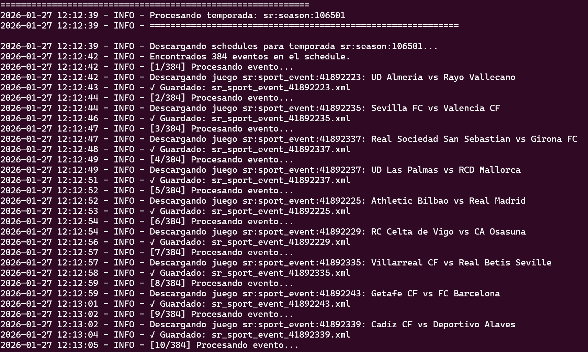
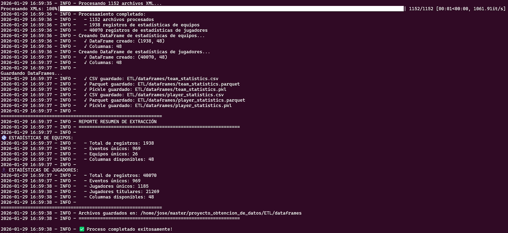

# Proyecto: Obtención y Extracción de Datos ⚽📈
### Master en Big Data & Business Intelligence | Next Educación

Este repositorio contiene el trabajo final desarrollado por el **Grupo 2** para la asignatura de **Obtención y Extracción de Datos**. El proyecto se centra en el ciclo de vida completo de los datos: desde el consumo de una API profesional hasta la visualización en un Dashboard interactivo, pasando por procesos de limpieza y transformación avanzada.

---

## 👥 Integrantes del Grupo 2
- **Jose Raul Alfaro Guillen**
- **Enma Sarai Carias Manzanares**
- **Lucas Jose da Silva**
- **Juan Luis Herrera Lozano**
- **Priscila Guaiba Von Pfuhl**

---

## 🎯 Objetivo del Proyecto
El objetivo principal es extraer y procesar información estadística de fútbol real para entender el rendimiento de los equipos de La Liga (España) en las temporadas 2023-24, 2024-25 y 2025-26. Hemos buscado transformar datos crudos y complejos (XML) en indicadores de negocio e insights deportivos claros.

---

## 📂 Estructura del Repositorio

A continuación detallamos el contenido de cada carpeta:

- **`ETL/`**: Contiene los procesos técnicos de manejo de datos.
    - **`extraccion_de_datos.py`**: Script encargado de conectar con la **API de Sportradar**, gestionar los límites de peticiones (rate limits) y descargar los datos de partidos en formato XML.
    - **`crear_dataframes.py`**: El "traductor". Toma los XML descargados, extrae las etiquetas relevantes y unifica la información en tablas (DataFrames) de Pandas.
    - **`games/`**: Repositorio local de archivos XML brutos. **Nota:** Siguiendo las políticas de privacidad y uso de datos de la API, solo se incluye un archivo XML de ejemplo. El resto de archivos fueron eliminados tras la generación de los DataFrames finales.
    - **`dataframes/`**: Almacena los archivos finales en formato **Parquet**. Elegimos este formato en lugar de CSV porque es un almacenamiento columnar altamente optimizado que comprime los datos y permite una lectura mucho más rápida, lo cual es crítico para que el Dashboard cargue fluidamente.
- **`EDA/`**: Análisis Exploratorio.
    - **`EDA.ipynb`**: Notebook donde realizamos la limpieza final, tratamos los valores nulos (como los de posesión de balón) y realizamos **Ingeniería de Variables** (Shot Accuracy, Shot Volume, etc.).
- **`streamlit/`**: Producto Final.
    - **`app.py`**: Un dashboard interactivo que permite filtrar por equipo y métrica, comparar perfiles tácticos mediante gráficos de radar y ver el historial de resultados.
- **`pyproject.toml`**: Gestión de dependencias del proyecto.

---

## 📡 Flujo de Datos

Nuestro flujo de trabajo siguió estas fases:

1.  **Extracción**: Consumimos la API de Sportradar (v4). Como esta explicado en el documento del trabajo, manejamos las descargas de manera jerarquica desde los seasons hasta los partidos individuales.

    

2.  **Transformación (ETL)**: Pasamos de datos anidados en XML a una estructura plana. Aquí enfrentamos el reto de que muchos partidos no traían estadísticas de "equipo", por lo que tuvimos que **reconstruirlas sumando las estadísticas individuales de cada jugador**.

    

3.  **Carga y Optimización**: Guardamos todo en archivos `.parquet` para asegurar que nuestra aplicación de Streamlit cargue los datos de forma instantánea.

---

## 🛠️ Tecnologías Utilizadas
Para este proyecto hemos aplicado los conocimientos adquiridos en el Master utilizando:
- **Lenguaje**: Python 3.10+
- **Librerías de Datos**: Pandas, NumPy, PyArrow.
- **Visualización**: Plotly Express, Plotly Graph Objects.
- **Dashboard**: Streamlit.
- **Fuente de Datos**: Sportradar Soccer API.

---

## 🚀 Cómo ponerlo en marcha

Para ejecutar este proyecto en tu entorno local:

1. Asegúrate de tener instalado Python.
2. Instala las dependencias necesarias utilizando el archivo de requerimientos:
   ```bash
   pip install -r requirements.txt
   ```
3. Lanza la aplicación interactiva:
   ```bash
   streamlit run streamlit/app.py
   ```
